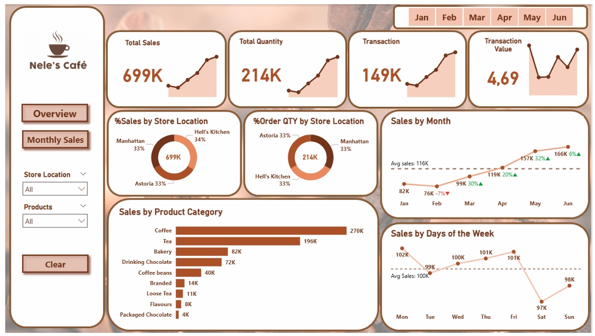
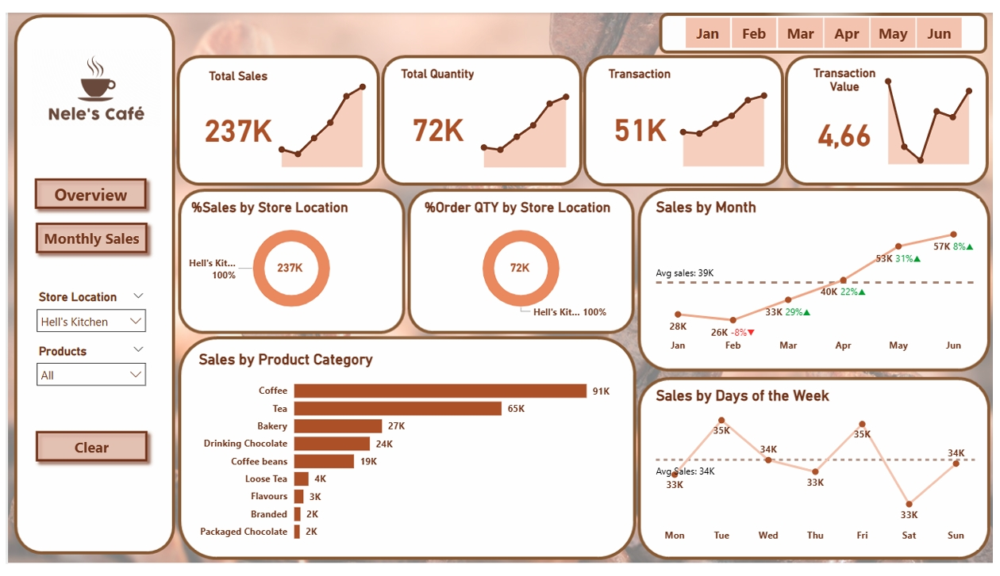
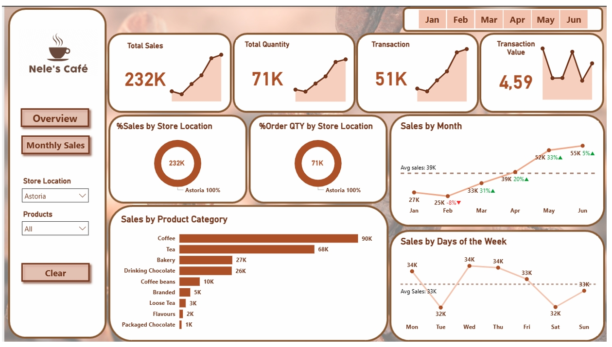
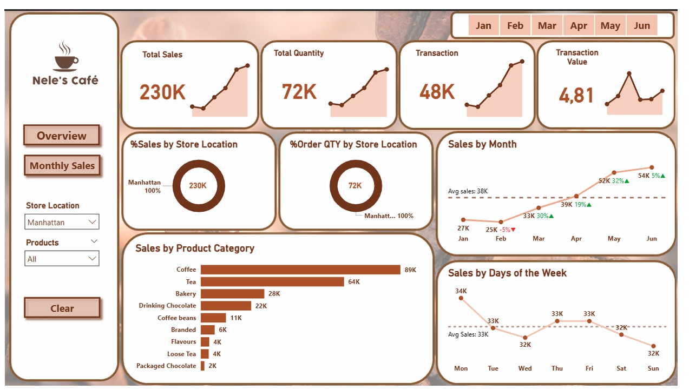
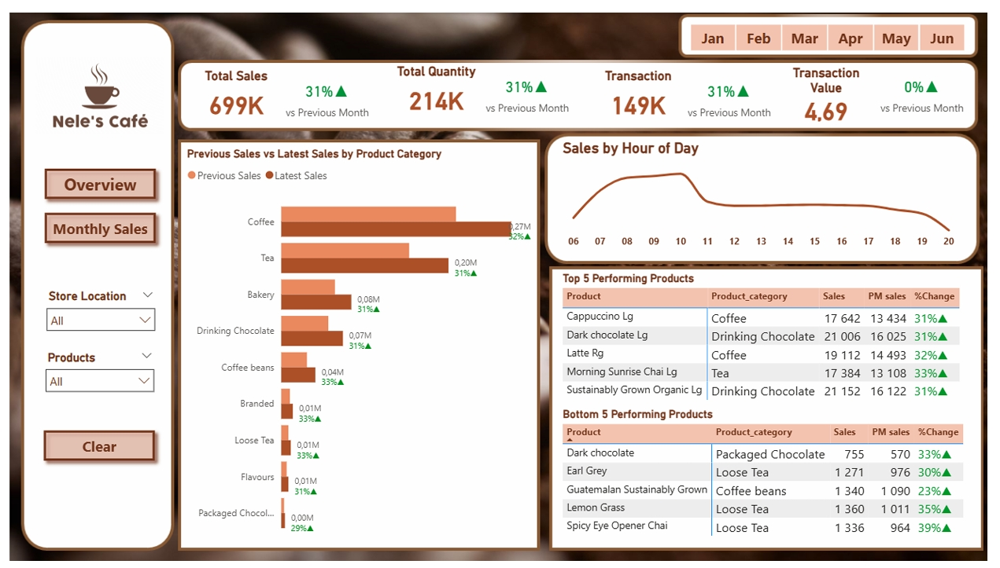

# ☕ Power BI: Nele's Café Performance Dashboard

## Project Overview

This project analyses the sales performance of a fictional coffee shop, **Nele's Café**, using a retail dataset sourced from Maven Analytics. The goal was to build an interactive Power BI dashboard that translates raw transaction data into clear, actionable business insights — answering real questions a café owner or operations manager would care about.

---

## Business Questions

The dashboard was designed to answer four key questions:

1. How are sales performing over time?
2. Which store locations are performing best?
3. What products drive the most revenue?
4. When do customers buy the most?

---

## Dashboard Preview

---

## Key Findings

### Sales Trend
Sales grew consistently from **$76K in February to $166K in June** — a 118% increase over five months. The average transaction value held steady at **$4.69**, indicating volume growth rather than price inflation.

### Store Performance
All three locations performed closely, with no single store dominating:

| Store | Total Sales |
|-------|------------|
| Hell's Kitchen | $237K |
| Astoria | $232K |
| Manhattan | $230K |

The near-equal split suggests strong brand consistency across locations.

### Top Products
**Coffee ($270K)** and **Tea ($196K)** are the clear revenue drivers, together accounting for the majority of total sales. The top individual performers were *Cappuccino Lg* and *Dark Chocolate Lg*, which ranked consistently across all months.

### Customer Buying Patterns
Two clear daily peaks emerged:
- **Morning rush: 8 AM – 11 AM** (primary peak)
- **Afternoon lull recovery: 4 PM – 5 PM** (secondary peak)

Saturday shows a consistent dip in sales, while Sunday recovers slightly.

---

## Recommendations

| Observation | Recommendation |
|-------------|---------------|
| Morning peak drives most revenue | Prioritise staffing and inventory around 8–11 AM to reduce wait times and avoid stockouts |
| Saturday sales consistently dip | Test weekend-only promotions or limited offers to drive foot traffic |
| Coffee & Tea dominate revenue | Consider bundle deals or loyalty incentives around top-selling items |
| Packaged Chocolate underperforms | Review profitability and consider replacing with higher-demand products |

---

## Tools Used

- **Power BI Desktop** — dashboard development and DAX measures
- **Maven Analytics Dataset** — source data

---

## What I Learned

This project strengthened my ability to go beyond surface-level charts and ask *why* patterns exist. The Saturday dip, for example, wasn't obvious until I overlaid store-level and product-level filters — which pointed to lower foot traffic rather than product issues. It reinforced the value of cross-filtering in exploratory analysis.
